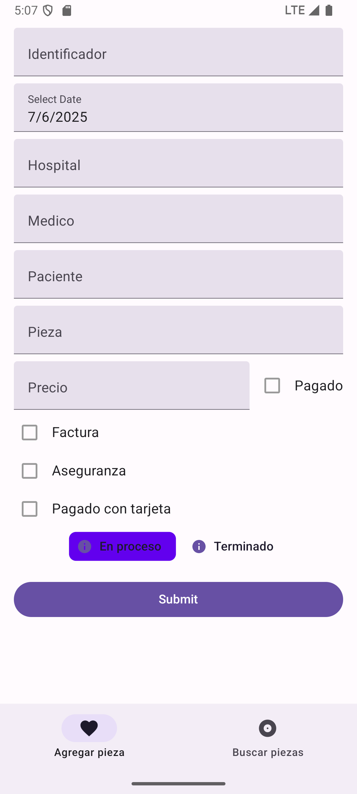
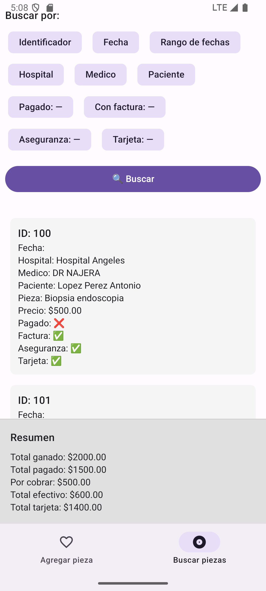

# 🧬 arenasCRM — Clinical Specimen Tracking & Cash Flow Control System (Alpha)

**arenasCRM** is a specialized mobile application built for pathology clinics, currently developed for Dr. Jorge Carlos Arenas, a renowned pathologist in Ciudad Juárez. It serves as a digital solution to register and monitor every specimen received, track monetary flow, and access historical case data efficiently.

This project is currently in **alpha**, and under active development.

---

## 📱 Screenshots

> *(Replace these with real screenshots once available)*

- New specimen entry  
- Case details view  
- Pending payment tracking  
- Search and retrieval of previous cases  




---

## 🚀 Key Features (Alpha)

- 📦 Register each specimen from reception to delivery
- 👤 Store patient name, description, and notes
- 💵 Track pending payments and incoming cash flow
- 🔍 Search old records quickly for on-demand report requests
- ☁️ Cloud-based backend (in progress, currently local)
- 📲 Android mobile application (iOS-ready with React Native)
- 🛡️ Backend includes authentication and role logic (frontend integration pending)

---

## 🧪 Tech Stack

| Layer        | Technology                |
| ------------ | ------------------------- |
| Frontend     | React Native              |
| Backend      | Go (custom logic)         |
| Architecture | Based on `LivePreview`    |
| Storage      | Local for now (VPS ready) |
| Design       | Mobile-first, user-focused|

---

## 💼 Business Context & Problem Solved

In local pathology clinics — especially in Ciudad Juárez — it’s uncommon to find digital systems even for basic operations. Many professionals still rely on Excel or paper-based records.

**arenasCRM** brings organization and structure to processes that were previously chaotic, making it easier for doctors to track both specimens and finances. This was especially valuable for Dr. Arenas, who needed to:

- Know how much money was flowing in or owed
- Locate past cases quickly when follow-up reports were requested
- Replace fragmented Excel workflows with a central, simple system

Even in this early stage, the app introduces digital order in an industry often underserved by modern software.

---

## 🎯 Vision & Roadmap

This is more than a demo — it's a foundation for something scalable.

Future milestones include:

- ✅ Full frontend integration of roles and authentication
- 🔔 Smart notifications for pending payments or overdue pieces
- 🔄 Cloud sync and backup for multiple users or clinics
- 🧾 PDF export or case summaries
- 📤 API for future clinic system integrations

arenasCRM is expected to grow from a tailored alpha into a broader product offering for more pathology professionals.

---

## 👨‍💻 Development Notes

- Project is fully developed by [@gamequic](https://github.com/gamequic)
- Built from scratch using proven architecture from `LivePreview`
- Backend is complete and tested; frontend is ongoing
- Active maintenance and client feedback loop in place

---

## 📦 Getting Started (Alpha - Dev Mode)

- Clone the repository
```
git clone https://github.com/gamequic/arenascrm.git
cd arenascrm
```

- Start development server (React Native)
```
npm install
npx react-native start
```

- Run on Android
```
npx react-native run-android
```


# 📬 Contact
Want to collaborate or learn more?

[GitHub @gamequic](https://github.com/gamequic)

[Portfolio](https://calleros.dev)

# 🛑 Disclaimer
This project is in alpha and built for internal clinical use only. It does not store real patient data in the demo. All names, examples, and functionality are either mock or based on controlled input.